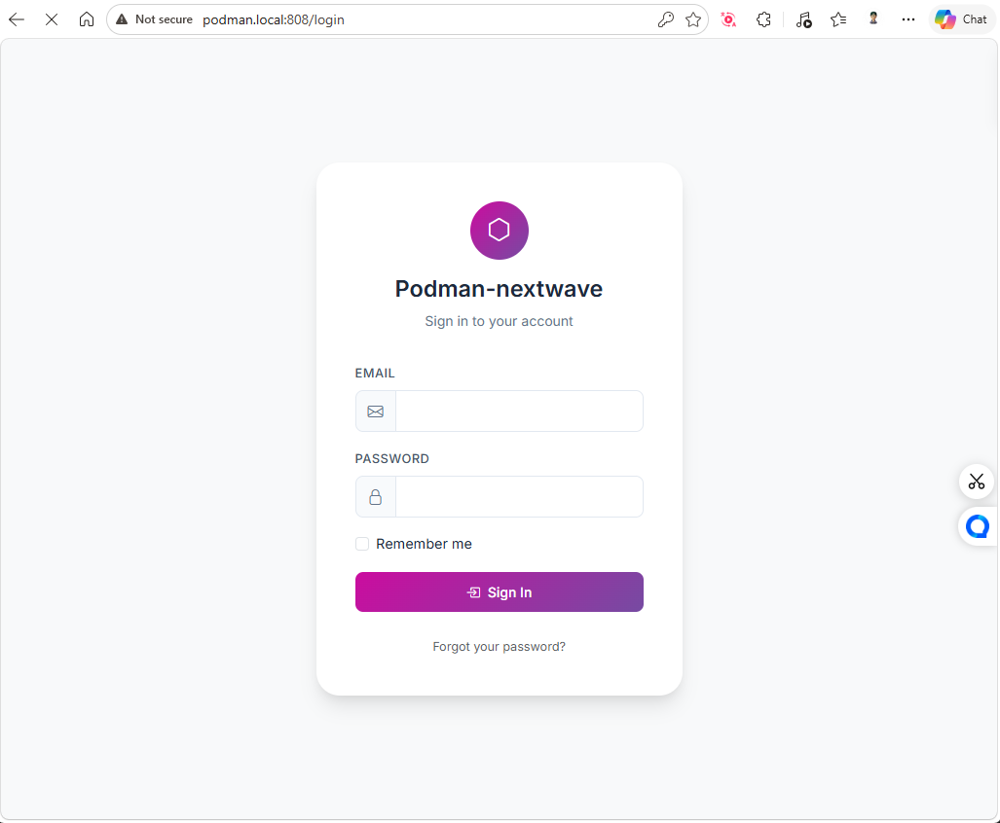
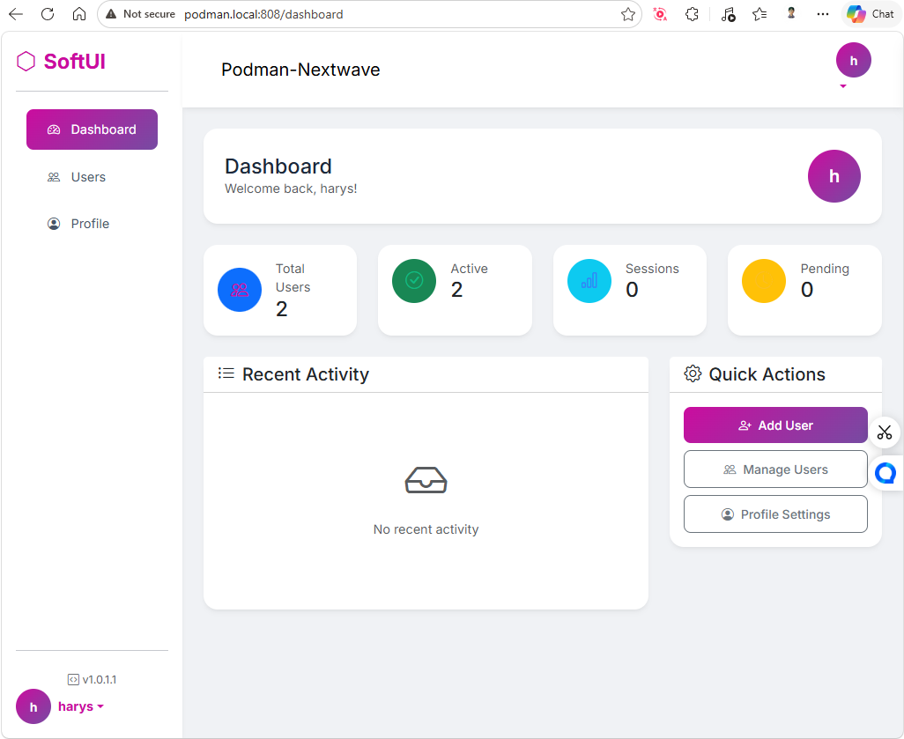

<p align="center"><a href="https://laravel.com" target="_blank"></a></p>

<p align="center">
<a href="https://github.com/laravel/framework/actions"></a>
<a href="https://packagist.org/packages/laravel/framework"></a>
<a href="https://packagist.org/packages/laravel/framework"></a>
<a href="https://packagist.org/packages/laravel/framework"></a>
</p>

## Screenshots

### Login Page


### Dashboard


## About Laravel

Laravel is a web application framework with expressive, elegant syntax. We believe development must be an enjoyable and creative experience to be truly fulfilling. Laravel takes the pain out of development by easing common tasks used in many web projects, such as:

- [Simple, fast routing engine](https://laravel.com/docs/routing).
- [Powerful dependency injection container](https://laravel.com/docs/container).
- Multiple back-ends for [session](https://laravel.com/docs/session) and [cache](https://laravel.com/docs/cache) storage.
- Expressive, intuitive [database ORM](https://laravel.com/docs/eloquent).
- Database agnostic [schema migrations](https://laravel.com/docs/migrations).
- [Robust background job processing](https://laravel.com/docs/queues).
- [Real-time event broadcasting](https://laravel.com/docs/broadcasting).

Laravel is accessible, powerful, and provides tools required for large, robust applications.

## Tech Stack

- **Laravel 13** (PHP 8.3)
- **Bootstrap 5** + Bootstrap Icons
- **Soft UI** custom styling
- **PostgreSQL** (10.10.0.6)
- **Redis** (10.10.0.7)

## UI Features

- Soft gradient colors (#667eea → #764ba2)
- Soft shadows and rounded corners
- Responsive sidebar navigation
- Bootstrap 5 components
- Custom auth pages with Soft UI

## Learning Laravel

Laravel has the most extensive and thorough [documentation](https://laravel.com/docs) and video tutorial library of all modern web application frameworks, making it a breeze to get started with the framework.

In addition, [Laracasts](https://laracasts.com) contains thousands of video tutorials on a range of topics including Laravel, modern PHP, unit testing, and JavaScript. Boost your skills by digging into our comprehensive video library.

You can also watch bite-sized lessons with real-world projects on [Laravel Learn](https://laravel.com/learn), where you will be guided through building a Laravel application from scratch while learning PHP fundamentals.

## Running with Podman

This project uses Podman for containerization (podman-compose.yml at root).

### Prerequisites
- Podman installed
- podman-compose installed (`pip install podman-compose` or equivalent)

### Quick Start
From project root (`c:/laravel-app`):

```bash
podman-compose up -d --build
```

- App: http://localhost:8080
- Postgres: localhost:5432 (user: postgres, pass: Password09, db: nextwave_db)
- Redis: localhost:6379

### Database Setup
Update `.env`:
```
DB_CONNECTION=pgsql
DB_HOST=postgres
DB_PORT=5432
DB_DATABASE=nextwave_db
DB_USERNAME=postgres
DB_PASSWORD=Password09
```

Run migrations:
```bash
podman exec nextwave php artisan migrate
```

### Known Issues

**Slow first request (~10s)**
- The app may be slow on the first request when accessed via host (localhost:8080)
- This is due to container network overhead
- Workaround: Use port mapping or run Vite dev server locally
- Local container requests (curl localhost:808) are fast

### Build Assets
```bash
cd nextwave
npm install
npm run build
```

### Useful Commands
- Stop: `podman-compose down`
- Logs: `podman-compose logs -f`
- Rebuild: `podman-compose up -d --build --force-recreate`
- Shell: `podman exec nextwave bash`

Volumes persist data in `./nextwave`.

## Contributing

Thank you for considering contributing to the Laravel framework! The contribution guide can be found in the [Laravel documentation](https://laravel.com/docs/contributions).

## Code of Conduct

In order to ensure that the Laravel community is welcoming to all, please review and abide by the [Code of Conduct](https://laravel.com/docs/contributions#code-of-conduct).

## Security Vulnerabilities

If you discover a security vulnerability within Laravel, please send an e-mail to Taylor Otwell via [taylor@laravel.com](mailto:taylor@laravel.com). All security vulnerabilities will be promptly addressed.

## License

The Laravel framework is open-sourced software licensed under the [MIT license](https://opensource.org/licenses/MIT).